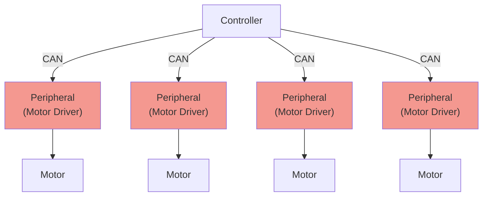

# Mbed CAN Motor Driver for spirit

[spirit](https://github.com/yutotnh/spirit) を用いた Mbed の モータードライバ制御プログラム

下の図の赤のノードに相当します

制御対象の回路は、 [yutotnh/CAN_H-Bridge_Solo_MD](https://github.com/yutotnh/CAN_H-Bridge_Solo_MD) です
