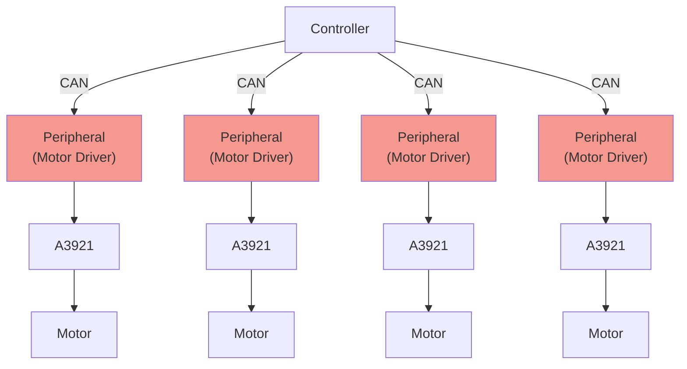

# Mbed CAN Motor Driver for spirit

[spirit](https://github.com/yutotnh/spirit) を用いた Mbed の モータードライバ制御プログラム

下の図の赤のノードに相当します



制御対象の回路は、 [yutotnh/CAN_H-Bridge_Solo_MD](https://github.com/yutotnh/CAN_H-Bridge_Solo_MD) です

## ⌨️ Development

### 🛠️ Build

リポジトリのルートディレクトリで下の手順を行うことで、ビルドできます

#### Mbed CLI 1

詳しくは、[公式のドキュメント](https://os.mbed.com/docs/mbed-os/latest/build-tools/mbed-cli.html)を参照してください

```shell
mbed deploy
mbed compile -t GCC_ARM -m NUCLEO_F303K8 # ビルドターゲットを STM32F303K8 でビルド
```

#### Mbed CLI 2

詳しくは、[公式のドキュメント](https://os.mbed.com/docs/mbed-os/latest/build-tools/mbed-cli-2.html)を参照してください

```shell
mbed-tools deploy
mbed-tools compile -t GCC_ARM -m NUCLEO_F303K8 # ビルドターゲットを STM32F303K8 でビルド
```

### 🐋 Development Containers

このリポジトリは、Visual Studio Code Dev Containers/GitHub Codespaces を含んでいます

Development Containers を利用することで、本プロジェクトでの開発に必要な最低限の環境(Mbed CLI 1/2等)を自動的に構築し、直ちに開発に取り組むことができます

使い方等の詳細は、 [Developing inside a Container](https://code.visualstudio.com/docs/devcontainers/containers) をご覧ください
